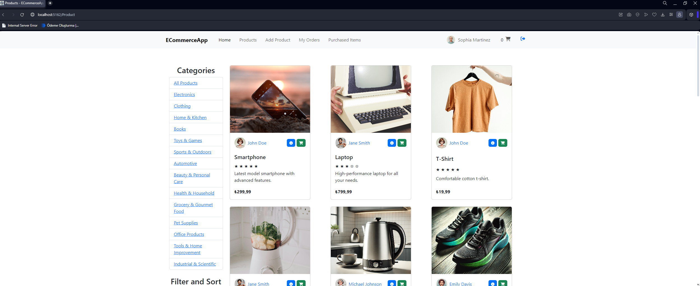
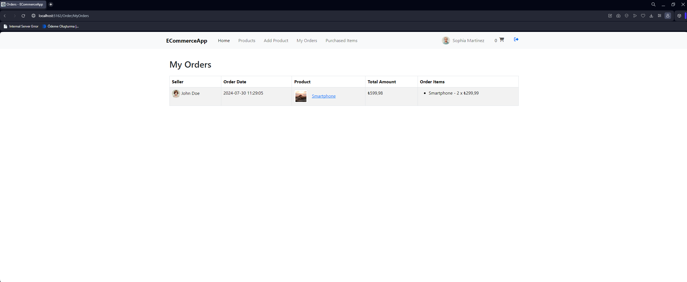
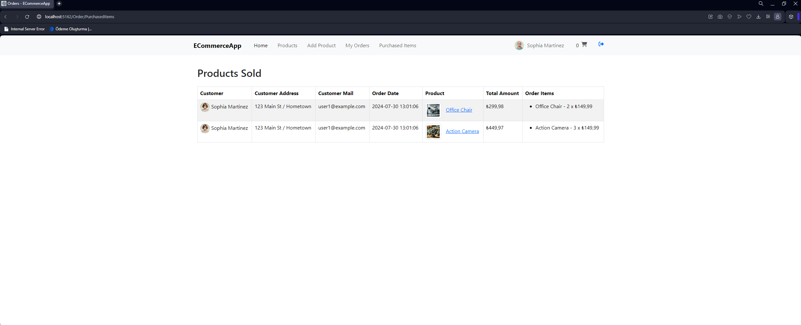
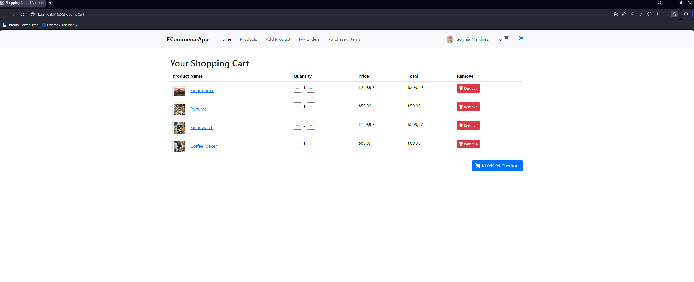

# ECommerceApp

ECommerceApp is an ASP.NET Core MVC application for an e-commerce platform integrated with the Iyzico payment gateway. This application supports both seller and customer functionalities, providing a comprehensive platform for managing products, orders, and payments.


## Technologies Used

- ASP.NET Core 8.0
- ASP.NET Core API
- MySQL
- Iyzipay API
- Ajax
- Bootstrap
- JavaScript
- jQuery


## Installation

1. Clone the repository:
    ```bash
    git clone https://github.com/Aaed517/asp-net-mvc-ECommerceApp.git
    cd ECommerceApp
    ```

2. Create `appsettings.json` file in the `ECommerceApp.Web` folder with the following content:
    ```json
    {
      "ConnectionStrings": {
        "DefaultConnection": "Server=localhost;Database=DbStoreAppDb;User=YourUserName;Password=YourPassword;"
      },
      "Logging": {
        "LogLevel": {
          "Default": "Information",
          "Microsoft.AspNetCore": "Warning"
        }
      },
      "IyzipayOptions": {
        "ApiKey": "iyzipayApiKey",
        "SecretKey": "İyzipaySecretKey",
        "BaseUrl": "https://sandbox-api.iyzipay.com"
      },
      "AllowedHosts": "*"
    }
3. Create a migration under the `ECommerceApp` directory:
    ```bash
    cd ECommerceApp
    dotnet ef migrations add InitialCreate-p ECommerceApp.Infrastructure -s ECommerceApp.Web -o Data/Migrations
    ```
    
4. Run the application:
    ```bash
    cd ECommerceApp.Web
    dotnet run
    ```

## Usage

- Register a new user or log in with an existing account. The application includes 6 predefined users created using data seeding. You can use these accounts to test the application:

    | Username           | Password      | First Name | Last Name    | 
    |--------------------|---------------|------------|--------------|
    | user1@example.com  | Password123*  | John       | Doe          |
    | user2@example.com  | Password123*  | Jane       | Smith        | 
    | user3@example.com  | Password123*  | Michael    | Johnson      | 
    | user4@example.com  | Password123*  | Emily      | Davis        | 
    | user5@example.com  | Password123*  | Daniel     | Wilson       | 
    | user6@example.com  | Password123*  | Sophia     | Martinez     |
  
- Browse products, add them to the cart, and proceed to checkout.
- Make payments securely using the Iyzico payment gateway.
  
## Example Screenshots


- Product Page: 
- MyOrder Page: 
- ProductSold Page: 
- ShoppingCart Page: 

## Sample Cards for Iyzico

| Card Network     | Card Number        |
|------------------|--------------------|
| Visa             | 4766620000000001   |
| Visa             | 4603450000000000   |
| MasterCard       | 5528790000000008   |
| MasterCard       | 5400360000000003   |
| Troy             | 9792020000000001   |
| Troy             | 9792030000000000   |
| American Express | 374427000000003    |

## Directory Structure

ECommerceApp/
│
├── ECommerceApp.Core/
│   ├── Models/
│   ├── Interfaces/
│   ├── Result.cs
│   └── ECommerceApp.Core.csproj
│
├── ECommerceApp.Infrastructure/
│   ├── Repositories/
│   ├── Services/
│   ├── Data/
│   │   ├── AppDbContext.cs
│   │   ├── Configurations/
│   └── ECommerceApp.Infrastructure.csproj
│
├── ECommerceApp.Application/
│   ├── Interfaces/
│   ├── Services/
│   ├── Dtos/
│   ├── Mapping/
│   │   └── MappingApp.cs
│   └── ECommerceApp.Application.csproj
│
├── ECommerceApp.Web/
│   ├── Controllers/
│   ├── Views/
│   ├── Models/
│   ├── wwwroot/
│   │   ├── css/
│   │   ├── js/
│   │   ├── lib/
│   │   └── images/
│   ├── Components/
│   ├── Program.cs
│   ├── appsettings.json
│   └── ECommerceApp.Web.csproj


## License

This project is licensed under the MIT License. See the [LICENSE](LICENSE) file for details.
